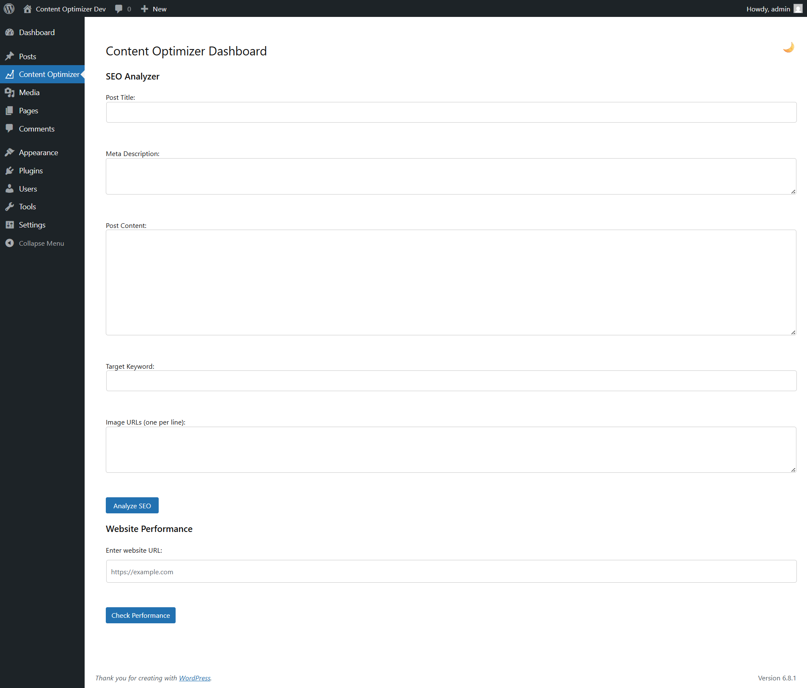
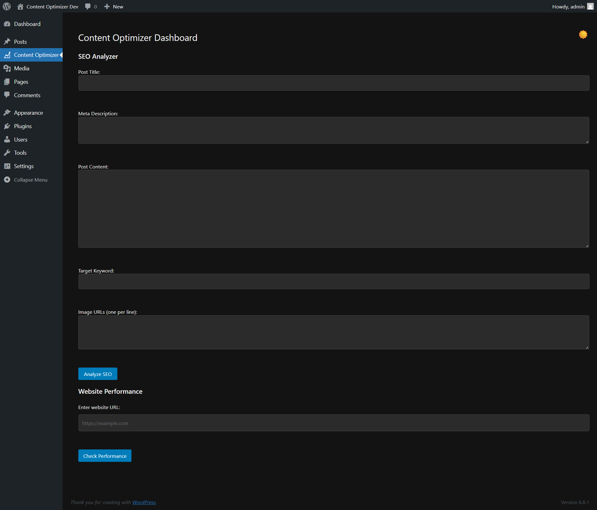

# 🚀 Content Optimizer Plugin for WordPress

A custom-built WordPress plugin that empowers users to **optimize content for SEO** and **evaluate performance** using real-time audits powered by **Google Lighthouse**. Designed for content creators, marketers, and developers to write content that is both search engine friendly and performance optimized.

---

## 🧩 Key Features

### 🔍 SEO Analyzer
- ✅ Validates Title and Meta Description
- ✅ Checks Target Keyword Usage
- ✅ Analyzes Image URLs for SEO relevance

### ⚡ Website Performance Audit (Lighthouse)
- Uses Google Lighthouse via a custom **Node.js server**
- Returns performance score instantly
- Tracks and stores performance history in the database 

---

## 🔧 Installation & Usage

### 1. 📦 WordPress Plugin 
1. Upload the folder `content_optimizer_plugin/` to:
   ```
   /wp-content/plugins/
   ```
2. Activate it via **WordPress Admin > Plugins**
3. Navigate to `Content Optimizer` in the admin sidebar

### 2. 🌐 Lighthouse Performance Server (Node.js)

#### Requirements:
- Node.js installed
- Lighthouse globally installed:  
  `npm install -g lighthouse`

#### Local Run:
```bash
cd server
npm install
node server.js
```

The server runs on:  
`http://localhost:3000`

> You must update the AJAX URL inside the plugin to point to this server.

#### Production Deployment (Recommended)
You can deploy the `server/` folder on any of the following free platforms:

| Platform   | 
|------------|
| [Render](https://render.com)     
| [Railway](https://railway.app)   
| VPS (like [Oracle Cloud](https://www.oracle.com/cloud/free/)) 

---

## 🖼️ Screenshots

| Light Mode | Dark Mode |
|--------------|-------------------|
|  |  |

---

## 📊 Performance History (Optional)

Performance audit results are stored in a custom WordPress DB table:  
`wp_optimizer_performance_history`  
You can extend the plugin to visualize trends using Chart.js or custom reports.

---

## ✨ Highlights

- Combines **PHP + JavaScript + Node.js + Lighthouse**
- Fully compatible with latest WordPress
- Extensible and production-ready
- Ideal for use cases in **content strategy, SEO teams, and dev audits**

---

## 🧪 Technologies Used

- WordPress (PHP, AJAX, MySQL)
- Node.js + Express
- Google Lighthouse (CLI)
- Chart.js *(Optional for graphs)*
- Vanilla JavaScript

---

## 📦 Deployment Advice 

- Deploy the Node.js Lighthouse audit server using platforms like Render or Railway for quick and cost-effective hosting.

- Include clear screenshots to showcase the plugin’s functionality in action.

- Highlight the full-stack architecture of the project:
  PHP ↔️ Node.js ↔️ Lighthouse, demonstrating seamless integration between backend and performance auditing services.

---

## 🧠 Author

**Rijo7**  
🔗 [GitHub Profile](https://github.com/rijo7)

> Built for learning, demonstrating full-stack plugin development, and showcasing readiness for real-world technical roles.

---

## 📜 License

This project is licensed under the [MIT License](LICENSE).